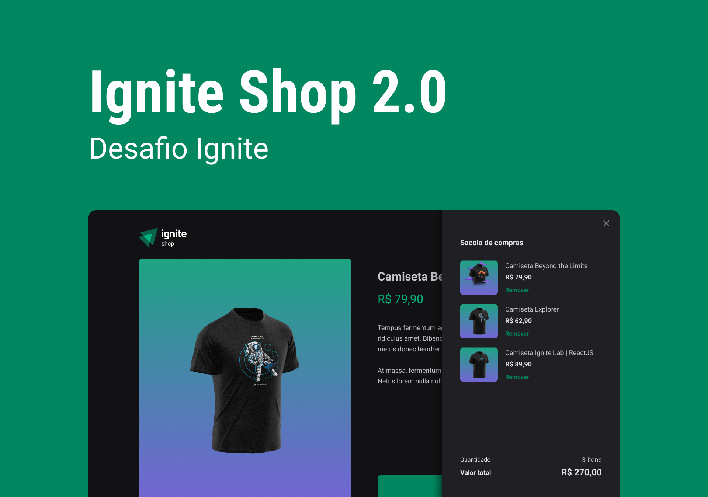

<h1 align="center">
    
</h1>
<p align="center">
-
</p>

### Sobre o projeto

---

### Tecnologias

<!-- - [AutoAnimate](https://auto-animate.formkit.com/) -->

- [NextJs](https://nextjs.org/)
- [Typescript](https://www.typescriptlang.org/)
- [Phosphor Icons](https://phosphoricons.com/)
- [Stitches](https://stitches.dev/)
- [Stripe](https://stripe.com/en-br)
- [Keen-slider](https://keen-slider.io/)
- [Axios](https://axios-http.com/)

### Instalação

1. Clone este repositório em sua máquina local:

```bash
$ git clone https://github.com/MauricioAires/shop-airs
```

2. Na pasta raiz do projeto, instale as dependências:

```bash
  $ npm install
```

### Utilização

Para rodar a aplicação em modo de desenvolvimento, utilize o seguinte comando:

```bash
  $ npm run dev
```

### Variáveis de ambiente

É necessário criar um arquivo `.env.local` na raiz do projeto para definir as seguintes variáveis de ambiente:

```bash
STRIPE_PUBLIC_KEY=
STRIPE_SECRET_KEY=
NEXT_URL=
```

### Contribuição

Contribuições são bem-vindas! Para contribuir, basta abrir uma issue ou pull request neste repositório.

### Licença

Este projeto está sob a licença MIT.
Veja [LICENSE](LICENSE) para mais informações.

---

### Autor

Feito por Mauricio Aires 👋🏽
